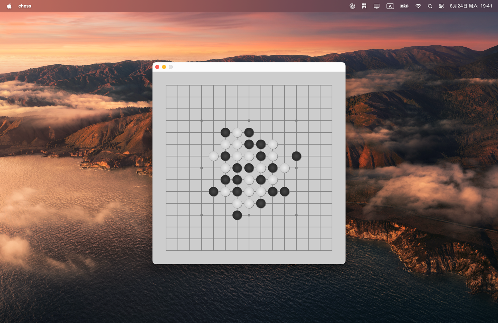

# Gomoku

This project is a simple implementation of the classic **Gomoku** game (also known as Five-in-a-Row) using C++ and the Qt framework. The game is played on a 15x15 board, and the first player to align five of their pieces horizontally, vertically, or diagonally wins.

## Features

- **Player Support**: Two players can play the game, one with black pieces and the other with white pieces.
- **Automatic Win Detection**: The game automatically checks for a win condition after each move.
- **Graphical Interface**: The game features a graphical interface created with Qt, displaying the board and pieces with smooth graphics.
- **Responsive Input**: The game responds to mouse clicks, allowing players to place their pieces on the board.



## Installation

### Prerequisites

- Qt Framework (version 5 or later)
- C++ Compiler (GCC, Clang, MSVC, etc.)
- CMake (version 3.10 or later)

### Build and Run

1. Clone the repository:

   ```bash
   git clone https://github.com/HuXin0817/Gomoku.git
   cd Gomoku
   ```

2. Create a build directory:

   ```bash
   mkdir build
   cd build
   ```

3. Configure the project using CMake:

   ```bash
   cmake ..
   ```

4. Build the project:

   ```bash
   cmake --build .
   ```

5. Run the executable:
   ```bash
   ./Gomoku
   ```

## Usage

1. **Launch the Game**: Run the `Gomoku` executable.
2. **Play the Game**: Click on any valid position on the board to place a piece. The game will alternate turns between the black and white players.
3. **Winning the Game**: The game will display the winner once five pieces are aligned in a row.

## Contributing

Contributions are welcome! If you have any ideas for improvements or new features, feel free to fork the repository and submit a pull request.

## License

This project is licensed under the MIT License - see the [LICENSE](LICENSE) file for details.

## Acknowledgements

- Thanks to the Qt community for providing comprehensive documentation and support.
